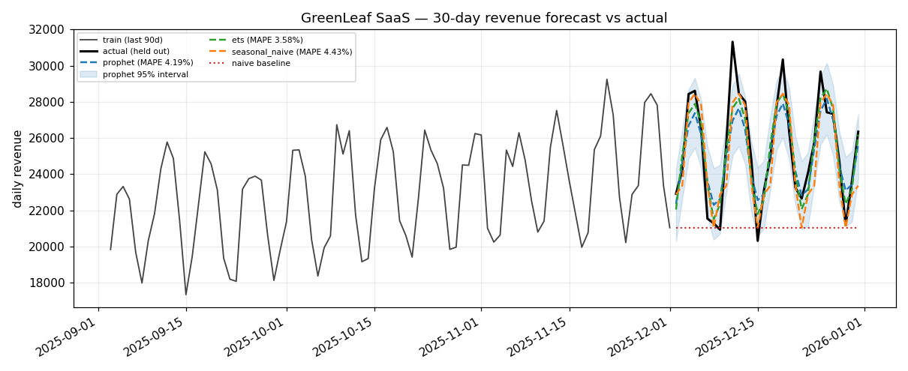

# StartupShield AI

### Most churn tools give you a number. This one gives you a reason — and a next move.

**A risk-monitoring dashboard that turns customer, review, and revenue data into a single 0–100 company risk score — with explanations, not just a number.**


Founders and CS teams usually find out a customer is about to churn from the cancellation email. StartupShield AI combines **churn prediction, sentiment analysis, anomaly detection, and forecasting** into one interpretable risk score for startups and SaaS companies, plus a rule-based recommendation engine that says what to actually do about it — before the email arrives. Upload your own customer/review/revenue exports and it scores a company the models have never seen — no retraining, no manual column renaming.

Every score comes with a plain-language reason and every reported metric comes with an honest caveat — see [Reading the reports honestly](#reading-the-reports-honestly). Nothing here is a black box you have to trust blindly.

> **Status: work in progress.** Core pipeline, all four ML modules, and the full 7-page dashboard are built and tested (see [Status & Roadmap](#status--roadmap)). Demo video/screenshots and a final polish pass are still open.



### At a glance

| Signal | Result | Caveat |
| --- | --- | --- |
| Churn (LightGBM) | ROC-AUC **0.85** on 2,500 customers | 3 of 5 features are proxies — see below |
| Anomaly detection | **5 / 5** injected anomalies recovered | Precision is a mechanical artifact of the contamination setting, not a quality score |
| Forecast vs. naive baseline | Beats "repeat last week" on **3 / 3** demo companies | Most of the gain is seasonality, not the model |
| Sentiment (TF-IDF + LogReg) | macro-F1 **1.00** on 3,000 reviews | Template-generated text — not proof of real-world generalization |

Full numbers and honest context for each of these live in [`reports/`](reports/) and [Reading the reports honestly](#reading-the-reports-honestly).

## Table of contents

- [Features](#features)
- [How the risk score works](#how-the-risk-score-works)
- [Quickstart](#quickstart)
- [Project structure](#project-structure)
- [Running the dashboard](#running-the-dashboard)
- [Scoring your own company](#scoring-your-own-company)
- [Reproducing the models](#reproducing-the-models)
- [End-to-end demo](#end-to-end-demo)
- [Tests](#tests)
- [Deploying](#deploying)
- [Reading the reports honestly](#reading-the-reports-honestly)
- [Status & Roadmap](#status--roadmap)
- [Project docs](#project-docs)
- [License](#license)

## Features

**Predict**

- **Churn prediction** — LightGBM classifier (compared against Logistic Regression, Random Forest, XGBoost) with SHAP-based per-customer explanations.
- **Sentiment analysis** — TF-IDF + Logistic Regression over customer reviews, flagging negative feedback.
- **Anomaly detection** — IsolationForest over daily business metrics, validated against injected anomalies.
- **Forecasting** — Prophet (with Holt-Winters and seasonal-naive fallbacks) for a 30-day forward projection with confidence bands, backtested against a naive baseline.

**Explain**

- **Explainable risk aggregation** — a single 0–100 score from a transparent weighted formula, not a black-box meta-model, with a plain-language "why it scored this way" string per company.

**Act**

- **Rule-based recommendation engine** — turns each risk signal into a prioritized, specific action.

**Use**

- **7-page Streamlit dashboard** with a persistent company selector, including live scoring for uploaded data.
- **Smart CSV import** — auto-detects columns from real exports (Stripe, Zendesk, etc.), derives `tenure` from any signup-date column, aggregates per-ticket data to per-customer, and degrades gracefully when a field or enough history isn't available.

## How the risk score works

```
risk_score = 100 × clip(
    w_churn     × churn_probability
  + w_sentiment × (1 − review_positivity)
  + w_anomaly   × anomalous_day_ratio
  + w_forecast  × projected_downside
, 0, 1)
```

Weights live in [`config/config.yaml`](config/config.yaml) (default `0.35 / 0.20 / 0.20 / 0.25`). Two things are worth knowing before quoting this number — both documented in full in [`DECISIONS.md`](DECISIONS.md):

- **It's a weighted formula, not a learned meta-model.** There's no labelled "company failed" dataset to train one on, so the weights encode a product judgement call.
- **Signals are rescaled to comparable ranges before weighting.** Churn probability genuinely spans 0.1–0.9 while the anomaly ratio tops out near 0.15, so without rescaling, churn would dominate the score regardless of the configured weights.

## Quickstart

```bash
git clone https://github.com/2ViShAlv1/StartUpShield.git
cd StartUpShield
python3 -m venv venv
source venv/bin/activate
pip install -r requirements.txt

python -m src.train_all       # trains + saves every model (~a few seconds)
streamlit run app/app.py      # opens the dashboard
```

`data/raw/*.csv` ships committed as a reproducible seed and `models/*.pkl` is gitignored, so a fresh clone only needs to train once — see [Reproducing the models](#reproducing-the-models). `requirements-optional.txt` holds dependencies for the optional future API/deployment phase and isn't needed to run the dashboard or tests.

## Project structure

```
app/                  Streamlit dashboard (app.py + 6 pages)
src/                  Pipeline: preprocessing, 4 ML modules, risk aggregator,
                       recommendation engine, smart CSV import, training driver
config/config.yaml    Hyperparameters, paths, risk weights (single source of truth)
data/raw/             Committed seed CSVs (churn, reviews, time-series)
models/               Trained models (gitignored, rebuilt by src/train_all.py)
reports/              Model evaluation reports, figures, EDA findings
notebooks/            EDA notebooks (churn, sentiment, time-series)
tests/                pytest suite, one file per module + dashboard smoke tests
sample_upload/        Example CSVs, including raw Stripe/Zendesk-style exports
docs/                 Build spec, glossary, demo narration scripts
```

## Running the dashboard

```bash
streamlit run app/app.py
```

Seven pages, with a company selector in the sidebar that persists across them:

| Page | What it shows |
| --- | --- |
| **Overview** | Headline 0–100 risk score, why it scored that way, top 3 recommended actions |
| **Upload Your Company** | Score *your own* data — CSV upload, validation, live result, JSON export |
| **Churn** | Risk distribution, SHAP drivers, highest-risk customer table |
| **Sentiment** | Sentiment mix, positivity trend, flagged negative reviews |
| **Anomalies** | Daily metrics with flagged days marked in red |
| **Forecast** | 30-day backtest plus a 30-day forward projection with confidence band |
| **Risk & Recommendations** | Full score breakdown by signal, SHAP chart, every recommendation |

Models are loaded once and cached; per-company scoring takes well under a second.

## Scoring your own company

The three built-in companies are demos. To score a real one, open the **Upload Your Company** page and upload CSVs (templates are downloadable in the page):

| File | Required? | Columns |
| --- | --- | --- |
| Customers | **yes** | `tenure, monthly_spend, usage_frequency, support_tickets, plan_type` |
| Reviews | optional | `review_text` |
| Daily metrics | optional | `date, revenue, active_users, signups` |

You do **not** supply `churn_label` — that's what the model predicts.

### You don't have to rename anything

Real exports never use these column names, and none of them export `tenure` at all. [`src/smart_import.py`](src/smart_import.py) handles that, so you upload the export as-is:

- **Column names are auto-detected.** A Stripe export's `Monthly Recurring Revenue`, `Plan Name`, and `Customer ID` map themselves; each guess is shown with a confidence level and can be overridden from a dropdown. A field with no plausible match is left blank rather than guessed wrong.
- **`tenure` is derived from any signup/created date column** — months are counted from the latest date *in the file*, not the wall clock, so re-running a historical export gives the same answer every time.
- **Per-ticket and per-session exports can be aggregated.** A Zendesk file with one row per ticket collapses into a per-customer count and joins onto the customer table by email; customers with no tickets get 0, not dropped.
- **Fields you genuinely don't track** (`support_tickets`, `usage_frequency`) default to 0, with a visible note that the score won't reflect those signals.

Example raw exports are in [`sample_upload/raw_exports/`](sample_upload/raw_exports/) if you want to try this without your own data.

What happens to your data, and why it's split this way:

- **Churn and sentiment use the pretrained models — inference only, no retraining.** These are customer- and text-level classifiers, so a pattern learned on one company's history is a reasonable prior for another's, and retraining per company would need far more data than a new signup has. Unseen `plan_type` values are handled (the pipeline one-hot encodes with `handle_unknown="ignore"`).
- **Anomaly detection and forecasting are fit fresh on your time series, on the spot.** There's no useful pretrained notion of "what does *this* company's normal day look like" — every company's baseline is its own.
- **Nothing is written to disk or sent anywhere.** Scoring happens in-session; the only output is the JSON report you choose to download.

Missing data degrades gracefully rather than failing: with fewer than 30 days of history, forecasting is skipped and the forecast signal is excluded from the score, with the reason shown on screen. Uploads are validated first ([`src/data_validation.py`](src/data_validation.py)) and every problem is reported at once.

## Reproducing the models

```bash
python -m src.train_all                   # trains + saves every model
```

`python -m src.generate_synthetic_data` regenerates `data/raw/` from scratch and is only needed to force-refresh the data itself — running it is harmless (it's deterministic under the configured seed) but unnecessary for a normal setup.

`src/train_all.py` regenerates the exact metrics published in `reports/`. Useful flags:

```bash
python -m src.train_all --module churn              # one module only
python -m src.train_all --seed 7                    # override config seed
python -m src.train_all --summary-json out.json     # write metrics as JSON
```

Hyperparameters and paths come from [`config/config.yaml`](config/config.yaml).

## End-to-end demo

```bash
python run_full_pipeline_demo.py
```

Scores all three demo companies, prints a full report for each, and writes summary JSON to `reports/demo/`.

## Tests

```bash
pytest
```

One test file per module, plus dashboard smoke tests covering all 7 pages × 3 demo companies.

## Deploying

See **[DEPLOYMENT.md](DEPLOYMENT.md)** for local testing steps, a manual test checklist, and Streamlit Community Cloud deployment.

Models are gitignored and trained on first load in the deployment environment (~4s, cached per container) rather than committed as pickles, which are fragile across library versions. The raw CSVs in `data/raw/` are committed as the reproducible seed.

## Reading the reports honestly

These published numbers need context — all documented in full in [`DECISIONS.md`](DECISIONS.md):

- **Churn:** three of five base features (`monthly_spend`, `plan_type`, `support_tickets`) are proxies derived from the source dataset; two are the same variable. See the proxy-feature warning in `reports/model_evaluation_churn.md` before quoting feature importances.
- **Sentiment macro-F1 = 1.0000:** an artifact of template-generated review text, not proof of real-world generalization.
- **Forecast beats the naive baseline by 5–13 pp:** most of that gain is simply capturing weekly seasonality — a zero-modelling "repeat last week" backend already gets most of the way there. See the seasonal-naive row in `reports/model_comparison_forecast.md`.
- **Demo company portfolios are curated, and two of three datasets are synthetic.** The three demo companies are built by slicing the flat customer and review tables using *behavioural* features (usage, support tickets) — never using model output — so the models still have to discover the risk. This is implemented in `src/demo_data.py` and disclosed in the dashboard sidebar.

## Status & Roadmap

Full phase-by-phase checklist is tracked in [`PROGRESS.md`](PROGRESS.md); implementation decisions and fallback notes in [`DECISIONS.md`](DECISIONS.md). Summary:

- ✅ **Done** — data pipeline, all 4 ML modules (churn, sentiment, anomaly, forecast), risk aggregation with SHAP, recommendation engine, full 7-page dashboard, smart CSV upload/scoring flow, test suite.
- 🚧 **In progress** — demo video/screenshots, final polish pass.
- 🔭 **Optional / not started** — FastAPI service, Dockerfile, CI pipeline.

## Project docs

| File | What's in it |
| --- | --- |
| `PROGRESS.md` | Phase-by-phase checklist of what's built |
| `DECISIONS.md` | Implementation decisions, deviations, and why |
| `DEPLOYMENT.md` | Local testing checklist + Streamlit Cloud deploy steps |
| `docs/MASTER_BUILD_SPEC.md` | Original requirements spec this project was built against |
| `docs/TERMS_GLOSSARY.md` | Hinglish glossary of churn/SaaS/ML terms used throughout |
| `docs/PITCH_DECK_PROMPT.md` | Prompt used to generate `StartupShield_AI_Pitch_Deck.pptx` |
| `docs/DEMO_NARRATION_GUIDE.md` | Full on-screen narration guide: project explained in depth, page-by-page script, numbers cheat sheet, judge Q&A, glossary |
| `docs/DEMO_SCRIPT_READALOUD.md` | Just the words to say — one continuous script, read top to bottom while recording |

## License

No license has been chosen yet — until one is added, default copyright applies (all rights reserved). If you'd like to use or build on this, open an issue or reach out.

---

Built by [@2ViShAlv1](https://github.com/2ViShAlv1) — issues and feedback welcome.
