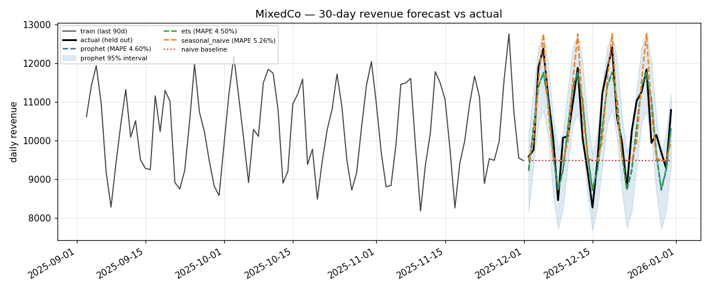
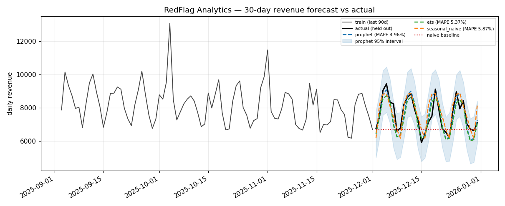

# Forecast Model Comparison

## Dataset

- Source files: `data/raw/timeseries_greenleaf_saas.csv`, `data/raw/timeseries_mixedco.csv`, `data/raw/timeseries_redflag_analytics.csv`
- Series forecast: `revenue` (daily)
- Rows per company: 365
- Split: **chronological**, last 30 days held out (never random-shuffled — that would leak future into past)
  - train rows: 335 per company
  - test rows: 30 per company
- Horizon: 30 days, from `config.yaml` `forecast.horizon_days`

## Models Compared

| Backend | Library | Confidence bounds | Role |
| --- | --- | --- | --- |
| Prophet | `prophet` 1.4.0 | Native 95% uncertainty interval | Configured default |
| ETS (Holt-Winters) | `statsmodels` 0.14.6 | Residual-based, widened by `sqrt(step)` | Fallback if Prophet unavailable |
| Seasonal naive | none | Residual-based, widened by `sqrt(step)` | Dependency-free last resort |
| **Naive baseline** | none | n/a | **The bar to beat** — last value carried forward |

Additive weekly seasonality is enabled (the generator injects a 7-day cycle); yearly
seasonality is disabled because only 365 days exist, which is too short to fit one.

The LSTM stretch goal was **not** attempted — see "Scope decisions" below.

## Results

### Per company, per backend

| Company | Backend | MAE | RMSE | MAPE | Coverage | Naive MAPE | Improvement | Beats naive |
| --- | --- | ---: | ---: | ---: | ---: | ---: | ---: | :---: |
| GreenLeaf SaaS | Prophet | 1068.11 | 1411.40 | 4.19% | 0.80 | 16.27% | +12.07 pp | ✅ |
| GreenLeaf SaaS | ETS | 908.99 | 1153.82 | **3.58%** | 1.00 | 16.27% | +12.68 pp | ✅ |
| GreenLeaf SaaS | Seasonal naive | 1131.47 | 1442.61 | 4.43% | 1.00 | 16.27% | +11.83 pp | ✅ |
| MixedCo | Prophet | 476.01 | 564.64 | 4.60% | 0.90 | 10.56% | +5.96 pp | ✅ |
| MixedCo | ETS | 466.99 | 552.53 | **4.50%** | 1.00 | 10.56% | +6.05 pp | ✅ |
| MixedCo | Seasonal naive | 538.91 | 634.21 | 5.26% | 1.00 | 10.56% | +5.30 pp | ✅ |
| RedFlag Analytics | Prophet | 373.96 | 474.17 | **4.96%** | 1.00 | 12.34% | +7.38 pp | ✅ |
| RedFlag Analytics | ETS | 412.83 | 504.77 | 5.37% | 1.00 | 12.34% | +6.97 pp | ✅ |
| RedFlag Analytics | Seasonal naive | 431.96 | 554.36 | 5.87% | 1.00 | 12.34% | +6.47 pp | ✅ |

### Mean across the three companies

| Backend | Mean MAPE | Mean coverage | Mean fit time |
| --- | ---: | ---: | ---: |
| ETS (Holt-Winters) | **4.48%** | 1.00 | 0.18 s |
| Prophet | 4.59% | 0.90 | 0.19 s |
| Seasonal naive | 5.19% | 1.00 | 0.002 s |
| Naive baseline | 13.05% | n/a | — |

## Actual vs Predicted Plots





Each plot shows the last 90 training days, the 30-day held-out actuals, all three backends,
Prophet's 95% interval, and the flat red naive baseline.

## Acceptance Criteria

- Required: `predict()` returns confidence bounds for **every** future date → **passed**
  (enforced in code and by `test_predict_returns_confidence_bounds_for_every_future_date`)
- Required: forecast beats the naive baseline on MAPE → **passed**, 3/3 companies,
  every backend, by 5.3–12.7 percentage points
- Status: **passed**

## Honest Notes

- **The naive baseline is a weak bar on this data, and most of the win is just seasonality.**
  Last-value-carried-forward ignores the injected 7-day cycle entirely, so it is punished hard
  (13.05% mean MAPE). The dependency-free seasonal-naive model — which does nothing but repeat
  the previous week — already reaches 5.19%. Prophet and ETS only add a further ~0.6–0.7 pp on
  top of that. The honest read: **capturing weekly seasonality delivers most of the value;
  the choice of sophisticated model delivers a little more.**
- **ETS marginally outperforms Prophet** (4.48% vs 4.59% mean MAPE) and wins on 2 of 3
  companies, with perfect interval coverage. The gap is well within noise across only three
  series, so this is not evidence that Prophet is worse — but it does mean the "fallback" is
  not a downgrade. Prophet remains the configured default per the build spec, and its native
  uncertainty interval is better principled than the ETS residual approximation.
- **Prophet's interval was too narrow on GreenLeaf SaaS** (coverage 0.80, i.e. 6 of 30 actuals
  fell outside a nominally 95% interval). GreenLeaf is the highest-variance series. Do not
  present Prophet's bounds as calibrated 95% intervals without saying this.
- **These are synthetic series** with clean additive trend, a fixed weekly cycle, and Gaussian
  noise — exactly the structure Prophet and ETS assume. Real revenue data has promotions,
  outages, holidays, and regime changes. Expect materially worse MAPE on real data; treat
  ~4–5% as a best case, not an expected production number.
- **ETS/seasonal-naive bounds are approximations.** Holt-Winters gives no native interval here,
  so bounds are `forecast ± 1.96 × residual_std × sqrt(step)`. That assumes normal, independent
  residuals and random-walk-style error growth. It is reasonable and honest, but it is not a
  properly derived predictive interval.
- **Anomalies were not excluded from training.** MixedCo and RedFlag contain injected anomalies
  inside the training window, which drag the fitted trend slightly. Feeding
  `anomaly_module` output back in to mask flagged days is a clear Phase 11 improvement.

## Scope Decisions

- **LSTM (PyTorch) was skipped.** The spec marks it an explicit stretch goal and "the first
  thing to drop". With 335 training points per company and a definition of done already met by
  a 0.18 s statistical fit, a neural model would add `torch` as a heavyweight dependency for no
  demonstrable gain. Recorded in `DECISIONS.md`.
- One model is fitted **per company** rather than one global model, because the three companies
  have different revenue scales, growth rates, and trend directions.

## Reproduce

```bash
python -m src.train_all --module forecast
```

Saved artifacts: `models/forecast_model_<company_slug>.pkl` (one per company). Prophet models
are persisted via `prophet.serialize` JSON rather than raw pickle, which is not portable.
